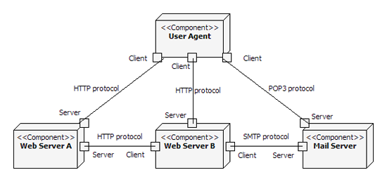

# Introduction

The Restlet Framework is composed of two main parts. First, there is the
[Restlet API](/documentation/user-guide/{}/core/overview "Part II - Core Restlet"),
a neutral API supporting the concepts of REST and HTTP, facilitating the
handling of calls for both client-side and server-side applications.
This API is backed by the Restlet Engine and both are now shipped in a
single JAR ("org.restlet.jar").

This separation between the API and the implementation is similar to the
one between the Servlet API and Web containers like Jetty or Tomcat, or
between the JDBC API and concrete JDBC drivers.

# Overview of a REST architecture

Let's step back a little and consider typical web architectures from a
REST point of view. In the diagram below, ports represent the connector
that enables the communication between components which are represented
by the larger boxes. The links represents the particular protocol (HTTP,
SMTP, etc.) used for the actual communication.

Note that the same component can have any number of client and server
connectors attached to it. Web Server B, for example, has both a server
connector to respond to requests from the User Agent component, and
client connectors to send requests to Web Server A and the Mail Server.

# Overview of a Restlet architecture

In addition to supporting the standard REST software architecture
elements as presented before, the Restlet Framework also provides a set
of classes that greatly simplify the hosting of multiple applications
within a single JVM. The goal is to provide a RESTful, portable and more
flexible alternative to the existing Servlet API. In the diagram below,
we can see the three types of Restlets that are provided in order to
manage these complex cases. Components can manage several Virtual Hosts
and Applications.

Virtual Hosts support flexible configuration where, for example, the
same IP address is shared by several domain names, or where the same
domain name is load-balanced across several IP addresses. Finally, we
use Applications to manage a set of related Restlets, Resources and
Representations. In addition, Applications are ensured to be portable
and reconfigurable over different Restlet implementations and with
different virtual hosts. In addition, they provide important services
like access logging, automatic decoding of request entities,
configurable status page setting and more!

In order to illustrate these classes, let's examine a simple example.
Here we create a Component, then add an HTTP server connector to it,
listening on port 8182. Then we create a simple trace ServerResource and attach
it to the defaut VirtualHost of the Component. This default host is
catching any request that wasn't already routed to a declared
VirtualHost (see the Component.hosts property for details). In a later
example, we will also introduce the usage of the Application class. Note
that for now you don't see any access log displayed in the console. 

import org.restlet.Component;
import org.restlet.data.Protocol;
import org.restlet.resource.Get;
import org.restlet.resource.ServerResource;

public class Test extends ServerResource {
    public static void main(String[] args) throws Exception {
        // Create a new Restlet component and add a HTTP server connector to it
        Component component = new Component();  
        component.getServers().add(Protocol.HTTP, 8182);  
        // Then attach it to the local host
        component.getDefaultHost().attach("/trace", Test.class);  
        // Now, let's start the component!
        // Note that the HTTP server connector is also automatically started.
        component.start();  
    }  
    @Get("txt")
    public String toString() {  
        // Print the requested URI path
        return "Resource URI  : " + getReference() + '\n' + "Root URI      : "
                + getRootRef() + '\n' + "Routed part   : "
                + getReference().getBaseRef() + '\n' + "Remaining part: "
                + getReference().getRemainingPart();  
    }
}


Now let's test it by entering
http://localhost:8182/trace/abc/def?param=123 in a Web browser. Here is
the result that you will get:

    Resource URI  : http://localhost:8182/trace/abc/def?param=123
    Root URI      : http://localhost:8182/trace
    Routed part   : http://localhost:8182/trace
    Remaining part: /abc/def?param=123
