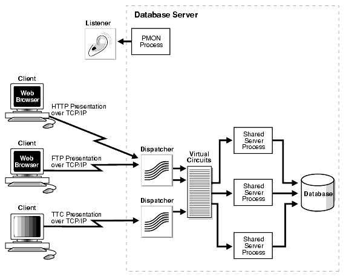

Oracle XDB Restlet adapter is a [Server connector](/documentation/user-guide/{}/core/base/connectors)
for [Restlet Framework](/) it provides to Oracle 11g the availability to support server side __REST Web Services__ (__WS__).

For doing that we use the Oracle JVM, an embedded JVM compatible with __JDK__ 1.5 running inside the database, it means using
same memory space and local access to the __SQL__ resources.

Additional to this __[Oracle XMLDB](http://www.oracle.com/technetwork/database/database-technologies/xmldb/overview/index.html)__ provides a __Servlet__ 2.2
compatible stack to implement server side __Servlets__.

These components work together to run __Restlet Framework__ and to receive HTTP request using the embedded listener.

Oracle also provides a [native SOAP support](http://docs.oracle.com/cd/B28359_01/appdev.111/b28369/xdb_web_services.htm#CHDDBCHB) for running native Web Services, but many people think that REST support brings to Oracle other features:
 - Simplicity, from developer's perspective __REST__ __WS__ are quite straightforward.
 - Leverage of all HTTP features for caching, you can use [Apache mod_cache](http://httpd.apache.org/docs/2.2/mod/mod_cache.html) or better than this [Oracle Web Cache](http://www.oracle.com/technetwork/middleware/webtier/overview/index.html#WebCache) and __[ESI invalidation protocol](http://web.archive.org/web/20121116044655/http://www.akamai.com/html/support/esi.html)__ to speed up your __WS.__ Also the [HTTP's 304 return code](http://www.infoq.com/news/2007/11/restful-ajax-http304).
 - Less network traffic, a simple SOAP service requires 675 bytes at __POST__ request and 306 bytes at response, similar __REST WS__ only requires 79 bytes at GET request and 28 bytes at response. If you have a site with million of hits these differences are a lot wasted resources.

** Architecture

Following picture depicts Oracle XDB Restlet adapter and Oracle components.

Note that Oracle SQLNet is accepting either connection using TTC presentation protocol (traditional Client/Server architecture) and HTTP/FTP Presentation protocol.

The application stack is depicted in the following picture:

